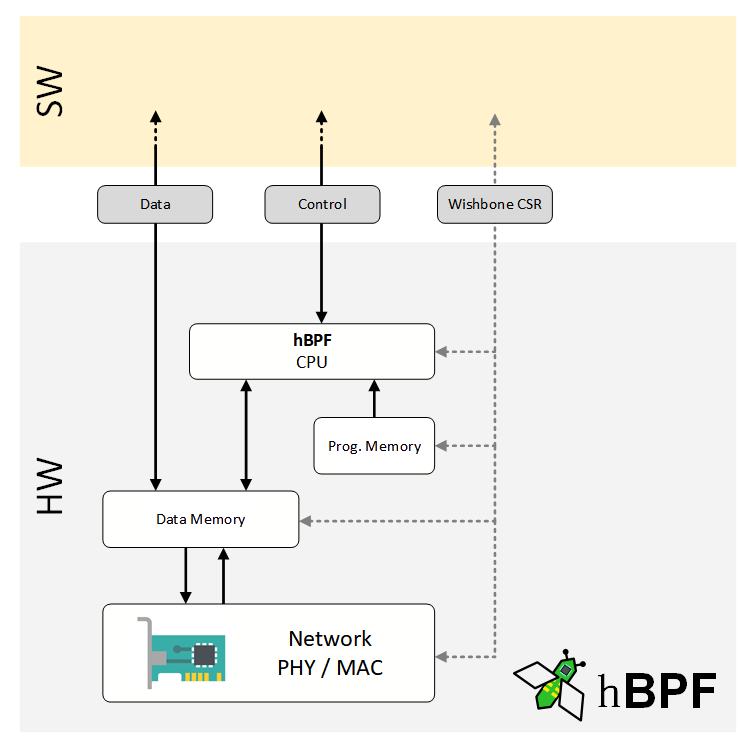
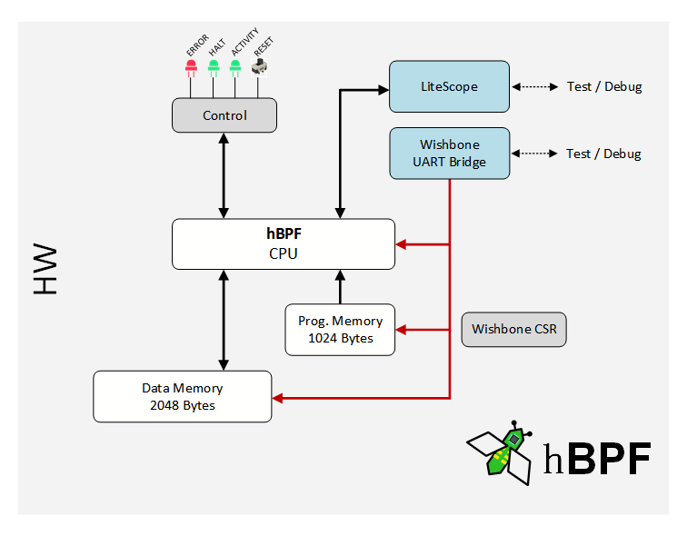

# hBPF = eBPF in hardware


An [extended Berkley Packet Filter (eBPF)](https://ebpf.io/)
CPU written entirely in [Python3](https://www.python.org/)
for PC and FPGA.

## History

Back in 1992 the original [Berkeley Packet Filter (BPF)](http://www.tcpdump.org/papers/bpf-usenix93.pdf)
was designed
for capturing and filtering network packets that matched
specific rules. Filters are implemented as programs to be run
on a register-based virtual RISC machine providing a small
number of instructions inside the Linux Kernel.

Soon it became clear that extending the Kernel by
user-supplied programs proves to be useful. But the design of
the virtual machine e.g instruction set (ISA) or register
width (32-bit vs. 64-bit) couldn't keep up with the demands.

At some point [in 2014](https://lwn.net/Articles/599755/),
work to extend the existing BPF virtual machine started to
make it useful in other parts of the Linux Kernel. More,
wider registers, additional instructions and a JIT eventually
resulted in [extended BPF](https://ebpf.io/). The original
and now obsolete BPF version has been retroactively renamed
to __classic BPF (cBPF)__. Nowadays, the Linux Kernel runs
eBPF only and loaded cBPF bytecode is transparently
translated into eBPF before execution.

The *hPBF* project now implements most of eBPF features in
hardware (FPGA).

## Goals

This project was started beginning of 2021 as an experiment
of how fast and how far you can get, with using alternate
hardware description languages (compared to the classic 'V'
languages VHDL and Verilog), most of the time open-source
tools (compared to expensive, commercial toolchains) and
cheap development boards (e.g [Arty-S7](https://reference.digilentinc.com/reference/programmable-logic/arty-s7/start)).

It is not meant to compete with multi-core accelerator cards
like [Xilinx Alveo](https://www.xilinx.com/products/boards-and-kits/alveo.html), instead its used to gain
insights and perform experiments.

## Current State

* All unit-tests pass
* Can process binaries created with assembler or C (LLVM) without changes
* not optimized
* no stack

## Installation

The following instructions gets you going, assuming no
requirements are installed on your system. If some of the
required components are already available then skip the
corresponding steps or packages.

```bash
# Install system dependencies (assuming Debian based distro)
$ sudo apt install git curl clang python3-pip make xxd libpcap0.8-dev openocd
# If you prefer 'hexdump' over of 'xxd'...
$ sudo apt install bsdmainutils
```

```bash
# For ubpf which uses python2
$ sudo apt install python-pip
$ pip install --user -r tools/ubpf/requirements.txt
```

```bash
# Python3 dependencies
$ pip3 install --user colour_runner
$ pip3 install --user git+https://github.com/javawizard/parcon
```

```bash
# Install rust - needed to compile tools
# See additional infos at:
# https://www.rust-lang.org/tools/install
$ curl --proto '=https' --tlsv1.2 -sSf https://sh.rustup.rs | sh
$ source $HOME/.cargo/env
```

```bash
# Create project root folder (e.g. projects)
$ mkdir -p projects
$ cd projects
```

```bash
# Install Litex
# See additional infos at:
# https://github.com/enjoy-digital/litex
$ mkdir litex
$ cd litex
$ curl -o litex_setup.py https://raw.githubusercontent.com/enjoy-digital/litex/master/litex_setup.py
$ chmod +x litex_setup.py
$ ./litex_setup.py init install --user
```

```bash
# Install hBPF
$ cd ..
$ git clone https://github.com/rprinz08/hBPF.git
$ cd hbpf
$ git submodule init
$ git submodule update
```

```bash
# Compile Tools
$ cd tools/rust-cbpf
$ cargo build
$ cd ../wishbone-utils/wishbone-tool
$ cargo build
```

```bash
# run Tests
$ cd ../../../tests
# This completes fast
$ ./test_vm.py
# This takes time ......
$ ./test_fpga_sim.py
# This needs an FPGA board ....
$ ./test_fpga_hw.py
```

For working with hardware you need in addition to the above,
a toolchain which supports your board/target.
This project includes two boards/targets from
Xilinx so to build the FPGA bitstreams yourself
you have to install [Xilinx Vivado](https://www.xilinx.com/products/design-tools/vivado.html).

*Note: Prebuilt bitstreams for included targets are provided.*

## Overview

The main purpose of implementing an eBPF CPU in hardware is
the same as that of the original cBPF: processing network
packets.

By attaching a hBPF CPU directly to a network PHY/MAC a form
of a [smart NIC](https://blog.mellanox.com/2018/08/defining-smartnic/) could be created. Such a NIC is capable
to perform tasks on packets offloaded by the host CPU for
performance reasons.

But a hBPF CPU has most necessary features so it can even be
used standalone as a simple microcontroller.

The following picture shows an overview of how hBPF can be
used.



hBPF is implemented using the [LiteX](https://github.com/enjoy-digital/litex)
SoC builder framework. LiteX itself is based on [Migen](https://github.com/m-labs/migen), a toolbox to create FPGA designs in Python3.


The hBPF CPU has access to separated program- and data-memory
([Harvard architecture](https://en.wikipedia.org/wiki/Harvard_architecture)).
Data-memory (8-Bit) holds network
packets (defaults to 2048 bytes) which are processed based on the
instructions in program memory (64-Bit, defaults to 1024 bytes).

At the moment the `/reset` signals goes HIGH,
the CPU starts processing instructions read
from program memory.
When processing the `exit` instruction, the `halt`
signal goes high and the CPU stops processing
instructions. Whenever an error occurs (e.g
division by 0, invalid instruction etc.) the
`error` signal is set HIGH and the CPU stops
processing instructions setting signal `halt` HIGH.

When CPU starts, internal `ticks` register is
cleared and incremented every clock tick until CPU
halts which can be used to measure execution speed.

The **math.divider** submodule contains divider and the
**math.shifter** a left/right shifter including arithmetic
shifts.

The project includes the following components:

### Emulator

To get a better understanding of how eBPF works an emulator
was developed in Python3. It implements a complete eBPF CPU
in Python and was a playground to try out concepts and
experiment with opcodes. The emulator code itself is not used
in the FPGA implementations.

### Simulator

The FPGA implementation of hBPF was done using LiteX and Migen
tools. The same Python3 code which later is converted
to Verilog and be tested with the simulation capabilities
from LiteX.

### FPGA Implementations

The LiteX hBPF implementation can be converted to
Verilog and processed by toolchains for various
target devices and boards. Included are two real
hardware implementations for Xilinx devices
(Spartan7 and Zynq) on
[Arty-S7](https://reference.digilentinc.com/reference/programmable-logic/arty-s7/start) and
[Zybo-Z7](https://reference.digilentinc.com/reference/programmable-logic/zybo-z7/start) boards.

Based on the following overview, they can be used to
test and debug hBPF and also to run the HW
unit-tests as described under *testing* further
down. They are not connected to an Ethernet PHY/MAC at the moment. Next samples will show how to use LiteETH to process real network packets.



Each implementation requires about 10500 LUTs
including Wishbone Bridge and LiteScope Debugger.
The CPU core alone requires about 8000 LUTs. Both
implementations were tested with 100MHz.

### Deviations from eBPF

In contrast to the eBPF implementation used in the Linux
Kernel, hBPF has some deviations and differences.

#### Calls

In eBPF, the `call` instruction is used to call selected
subroutines in the Linux Kernel (so called *Helper Functions*)
. In the hBPF implementation, the `call` opcode can be used
to extend the CPU for example by a hardware implemented
pseudo random number generator (e.g. [LFSR](https://en.wikipedia.org/wiki/Linear-feedback_shift_register)) or to
provide I/O functions. They can be provided by means of a
`call_handler` Migen Module when creating a CPU instance.
Some examples are included in this project.

#### Register R1

In the Linux eBPF implementation register R1 is used as base
pointer to the data-memory. This is not necessary for hBPF so
register R1 is always initialized to zero after a reset.

#### Stack

Not supported at the moment.

## Development

This section is divided in two parts:

* Developing hBPF

    describes how to develop hBPF itself, modifying or extending it.

* Developing for hBPF

    describes how to develop software which runs on a hBPF (or eBPF) CPU.

## Developing hBPF

### Requirements

hBPF is completely written in Python3 and uses the following tools:

* [Python3](https://www.python.org/)
* [LiteX](https://github.com/enjoy-digital/litex)
* [userspace BPF (uBPF)](https://github.com/iovisor/ubpf)
* [cbpf-rust](https://github.com/mmisono/rust-cbpf)
* [wishbone-utils](https://github.com/litex-hub/wishbone-utils)
* FPGA Toolchain (e.g. [Xilinx Vivado](https://www.xilinx.com/products/design-tools/vivado.html))
* [OpenOCD](http://openocd.org/) to load/flash FPGA targets (can normally be done by toolchain but OpenOCD is simpler and faster)
* [VS-Code](https://code.visualstudio.com/) as IDE and Test-runner

### Building

Assuming you have all prerequisites installed and their
binaries are available via search path, perform the following
steps:

1. check out hBPFs Git repository

2. open hBPF repository folder in VS-Code

   * start developing

3. run unit-tests either inside VS-Code or direct from the command line.

4. to build an FPGA bitstream for a real hardware target, select a target in `source/fpga/hw` folder and run `build.py`.

### Testing

All three hBPF implementations can be tested using
comprehensive unit-tests. All based on the same set of test
cases. To accomplish this, the Python based eBPF assembler of
the [userspace BPF (uBPF)](https://github.com/iovisor/ubpf) project is used.

Unit-tests can either be run from inside VS-Code or direct
from command line in `tests` folder.

* `test_vm.py` - run test cases against emulated CPU (fast)
* `test_fpga_sim.py` - runs tests against simulated FPGA design (takes long, be patient)
* `test_fpga_hw.py` - runs test-cases against hBPF CPU running on real hardware via a serial Wishbone bridge (medium fast)

Each test-case consists of a file in the `test` (or one of
its sub-folders) folder. Test files are text files with a `.
test` file extension. It consists of sections starting with
`--` describing the test. The following test description shows
a Fibonacci test with an `asm` section which is compiled on
the fly before the test is executed, an `args` section which
defines the input values, a `result` section defining whats
expected in register R0 after test completes and an `expected`
section which defines additional criterias that must be
met like the number of clock cycles the test may take.

```
# Example test case description. Calculating the Fibonacci
# for provided input in register R1
-- asm
mov r0, r1
jeq r1, 0, +11
jeq r1, 1, +9
mov r3, 0
mov r0, 1
mov r2, 2
mov r4, r0
add r0, r3
add r2, 1
mov r3, r4
jgt r2, r1, +2
ja -6
mov r0, 1
exit
-- args
r1 = 9
-- result
0x22
-- expected
clocks = 324
```

Also available are a `raw` section which describes a test
program as hex dump and a `mem` section which describes the
data-memory as hex dump.

Before executing a test the `asm` section is compiled to
binary and sent to the device under test (either the
emulator, simulator or hardware). For real hardware this is
done using the Wishbone serial bridge. If a `raw` section is
found in the test description it is sent after converting to
binary from hex dump. Also the data-memory is loaded from the
`mem` section contents if available.

Next input registers R1-R5 are set according to `args`
section. If section is not available or some
registers are not set in section then they are set to 0. To
start the test the hBPF CPU is brought out of reset by
setting `RESET_N` signal to HIGH and monitoring hBPF CPU
signals until `HALT` signal goes high or expected clocks
(when not specified default clocks = 1000) are reached. Then
control signals and output register R0 are compared against
the test definition.

## Developing for hBPF

The existing eBPF development tools (compilers, assemblers,
filters) can be used to develop for hBPF. Samples can be found
in the `development` directory.

## Hardware targets

Two hardware targets are included:

[Arty S7](source/fpga/hw/arty-s7-50/readme.md)

[Zybo Z7](source/fpga/hw/zybo-z7-20/readme.md)

## Misc

This project is by no means complete or. Feel free to play
with it and contribute if you find a bug or thing there are
thing which could be made better.

### License

This project is licensed under **BSD 3-Clause License**.
See [LICENSE](LICENSE) file.

### Logo / Icon


The **PCbee** (Printed Circuit Board Bee) was created based
on [ebpf.io](ebpf.io)'s bee icon to visualize the hardware
aspect of hBPF.
